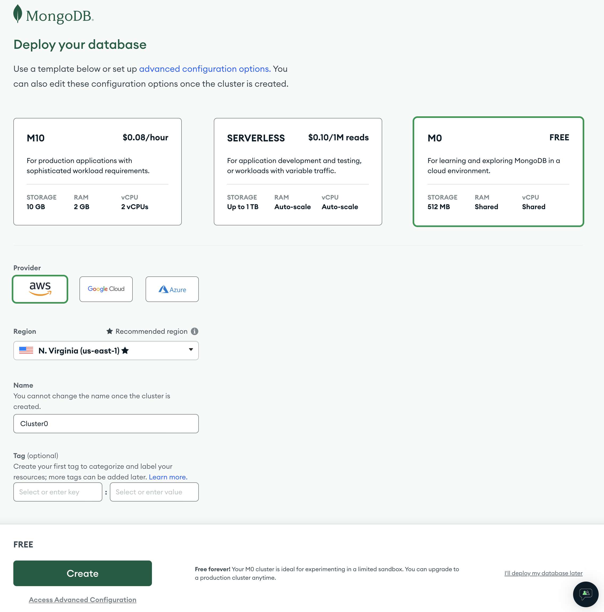
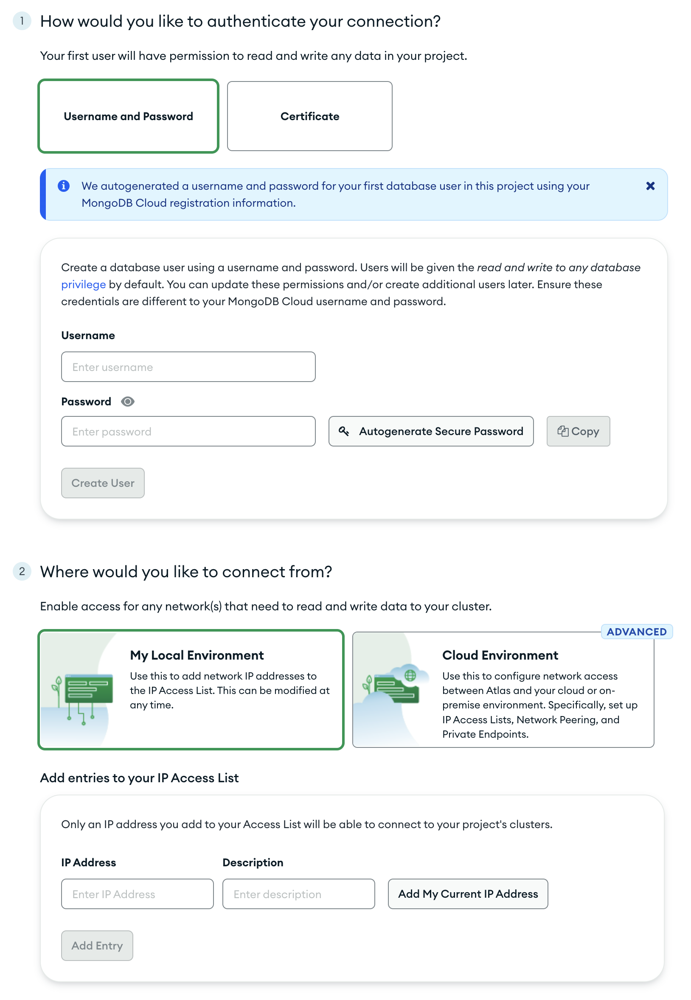
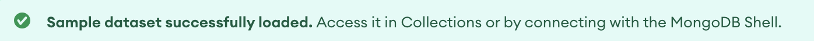
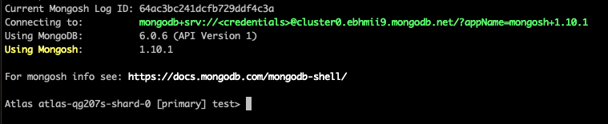
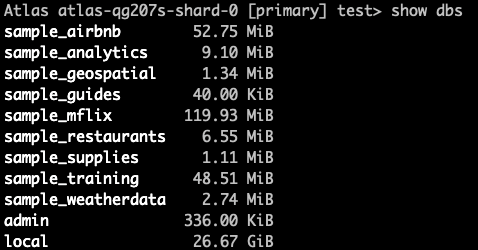

# Learn MongoDB

## Why Learn MongoDB

Learning MongoDB can enhance your skill set as a tech professional, open up career opportunities, and equip you with the tools to work with modern data models and scalable databases effectively. Here are a few additional reasons to consider learning MongoDB.

 **Industry Demand:** MongoDB is widely used in tech companies, making it valuable to learn for better job prospects.

**NoSQL and Flexibility:** MongoDB's NoSQL and document-oriented approach enable handling diverse data scenarios and offer a different perspective than relational databases.

**Scalability and Performance:** MongoDB scales horizontally, handles large data volumes, and high traffic loads efficiently.

**Developer-Friendly:** MongoDB's user-friendly query language simplifies interaction with the database and streamlines development.

**Integration with Modern Tech Stack:** MongoDB integrates well with popular tech stacks, frameworks, and cloud platforms.

## How to Learn MongoDB

There are many ways to start learning MongoDB. MongoDB provides official documentation as well as MongoDB University to help new and experienced users learn and hone their skills, both free and highly recommended resources.

[MongoDB Official Documentation](https://www.mongodb.com/docs/)

[MongoDB University](https://learn.mongodb.com/)

# MongoDB Primer

If you want to quickly get started or simply understand how MongoDB works, this primer is perfect for you.

At the time of writing this (July 10th 2023) I am using the following versions:

| Software | Version |
| --------- | -------|
| MongoDB | 6.0.6 (API Version 1) |
| Mongosh | 1.10.1 |
| MongoDB Compass | 1.38.2 |

## Create a Free Account

We will be using MongoDB Atlas for this primer. MongoDB Atlas is a managed cloud database service that allows you to easily deploy, scale, and manage MongoDB databases without worrying about infrastructure setup or maintenance.

Create a free account [here](https://www.mongodb.com/cloud/atlas/register)

## Deploy Database 

After you confirm your email and sign in you will see the Deploy your database screen. 



Choose the free M0 option and select the provider that has a region closest to your location. 

## Security Setup

On the next screen you will have some options to secure your account. 



I used the following options for this guide:

**Authenticate Connection:** Username and Password

**Connect from:** My Local Environment

You will also need to add your IP address to the access list by choosing "Add My Current IP Address."

Save and continue to the Atlas main page.

## Load Sample Data

We will use the sample data that MongoDB provides for the following exercises. You might see an option to load sample data like this one:

 

If you don't see the option to load sample data at the top you can do so by selecting the more options icon (...) and then selecting "Load Sample Dataset" like this:


Confirm that you are about to load the sample data and wait for the following message to confirm it has been loaded:



<!-- Break this into separate sections-->

## Installing mongosh

Next you need to install `mongosh` the process varies depending on your local operating system. Follow the download and install instructions for your system [here](https://www.mongodb.com/docs/mongodb-shell/install/)

Once you have `mongosh` installed you are ready to connect. 

## Connecting via Shell

Click the "Connect" button in Atlas:


This will bring up the menu to choose the type of connection, select "Shell" :


Since you already have MongoDB Shell installed choose that option and then copy/paste the connection string into your terminal.

>**Note** Remember to replace `<username>` with the username you created when you deployed the cluster.


Enter your password for that user and press enter. You should see something like this when you are connected:



You are now connected via mongosh!

## Basic Navigation

To show all of the databases run the following command:

`show dbs`

<details><summary>See output</summary>



</details>

Let's use the `sample_restaurants` database for our first practice exercise. 

Switch to the `sample_restaurants` database by using the `use` command:

`use sample_restaurants`

> **Note** If a database dose not exist the `use` command will create it. To avoid misspelling use tab complete. 

You should see a confirmation message that you've switched to the sample_restaurants database.

Now that you are in the sample_restaurants database, run the show command but for collections:

`show collections`

You should see the neighborhoods and restaurants collections. Let's focus on the restaurants collection first. 

## Reading Data

Before we begin reading and inturpreting data in the documents lets look at how the documents are structured in the restaurant collection.

To see a single document in a collection use the `findOne()` function. Run the following command to see an example:

`db.restaurants.findOne()`

Here is a sample of the output:
```json
{
  _id: ObjectId("5eb3d668b31de5d588f4292a"),
  address: {
    building: '2780',
    coord: [ -73.98241999999999, 40.579505 ],
    street: 'Stillwell Avenue',
    zipcode: '11224'
  },
  borough: 'Brooklyn',
  cuisine: 'American',
  grades: [
    { date: ISODate("2014-06-10T00:00:00.000Z"), grade: 'A', score: 5 },
    { date: ISODate("2013-06-05T00:00:00.000Z"), grade: 'A', score: 7 },
    {
      date: ISODate("2012-04-13T00:00:00.000Z"),
      grade: 'A',
      score: 12
    },
    {
      date: ISODate("2011-10-12T00:00:00.000Z"),
      grade: 'A',
      score: 12
    }
  ],
  name: 'Riviera Caterer',
  restaurant_id: '40356018'
}
```
> **Note** the _id: field is a unique value that identifies each document, you can set this value manually or you can let MongoDB assign a unique _id to new documents when they are created

Now that we know the structure of the documents we can start using the data. 

 First let's see how many documents are in the restaurants collection we'll use the `countDocuments` function. 

Run the following command to see how many restaurants are in the collection and compare your answer to the one below:

`db.restaurants.countDocuments()`

<details><summary>See answer</summary>

25359

</details>

We are about to build out a query to find specific restaurants. we'll do it in steps so that you can see how each field changes the results.

### Using Find and countDocuments

By adding fields to search for values we can refine this list. Here is the command to find all "American" cuisine restaurants in the collection:

`db.restaurants.find({cuisine: "American"})`

There are lots of documents that match, what is the command you should use to see the exact count? Check your answer below:

<details><summary>See answer</summary>

`db.restaurants.countDocuments({cuisine: "American"})`

</details>

How many documents were there?

<details><summary>See answer</summary>

6183

</details>

Let's narrow our results even further. Lets look for American cuisine restaurants in the Bronx. You can add additional fields and values separated by a comma, like this (we'll stick with `countDocuments` for now to return the number of results):

`db.restaurants.countDocuments({cuisine: "American", borough: "Bronx"})`

<details><summary>See answer</summary>

411

</details>

Suppose we want a Tavern like atmosphere, lets use regex to find restaurants with Tavern in the name and list the number of matching documents:

`db.restaurants.countDocuments({"name": { $regex: /Tavern/} ,cuisine: "American", borough:"Bronx"})`

<details><summary>See answer</summary>

8

</details>

To see the documents that match our criteria replace the `countDocuments()` function with the `find()` function.

`db.restaurants.find({"name": { $regex: /Tavern/} ,cuisine: "American", borough:"Bronx"})`

