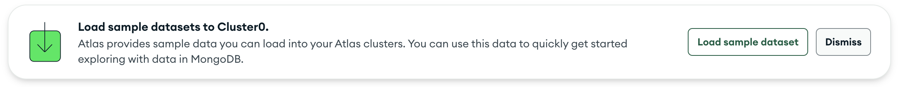

# Learn MongoDB

## Why Learn MongoDB

Learning MongoDB can enhance your skill set as a tech professional, open up career opportunities, and equip you with the tools to work with modern data models and scalable databases effectively. Here are a few additional reasons to consider learning MongoDB.

 **Industry Demand:** MongoDB is widely used in tech companies, making it valuable to learn for better job prospects.

**NoSQL and Flexibility:** MongoDB's NoSQL and document-oriented approach enable handling diverse data scenarios and offer a different perspective than relational databases.

**Scalability and Performance:** MongoDB scales horizontally, handles large data volumes, and high traffic loads efficiently.

**Developer-Friendly:** MongoDB's user-friendly query language simplifies interaction with the database and streamlines development.

**Integration with Modern Tech Stack:** MongoDB integrates well with popular tech stacks, frameworks, and cloud platforms.

## How to Learn MongoDB

There are many ways to start learning MongoDB. MongoDB provides official documentation as well as MongoDB University to help new and experienced users learn and hone their skills, both free and highly recommended resources.

[MongoDB Official Documentation](https://www.mongodb.com/docs/)

[MongoDB University](https://learn.mongodb.com/)

# MongoDB Primer

If you want to quickly get started or simply understand how MongoDB works, this primer is perfect for you.

At the time of writing this (July 10th 2023) I am using the following versions:

| Software | Version |
| --------- | -------|
| MongoDB | 6.0.6 (API Version 1) |
| Mongosh | 1.10.1 |
| MongoDB Compass | 1.38.2 |

## Create a Free Account

We will be using MongoDB Atlas for this primer. MongoDB Atlas is a managed cloud database service that allows you to easily deploy, scale, and manage MongoDB databases without worrying about infrastructure setup or maintenance.

Create a free account [here](https://www.mongodb.com/cloud/atlas/register)

## Deploy Database 

After you confirm your email and sign in you will see the Deploy your database screen. 

Choose the free M0 option and select the provider that has a region closest to your location. 

## Security Setup

On the next screen you will have some options to secure your account. 

I used the following options for this guide:

**Authenticate Connection:** Username and Password

**Connect from:** My Local Environment

You will also need to add your IP address to the access list by choosing "Add My Current IP Address."

Save and continue to the Atlas main page.

## Load Sample Data

We will use the sample data that MongoDB provides for the following exercises. You might see an option to load sample data like this one:

